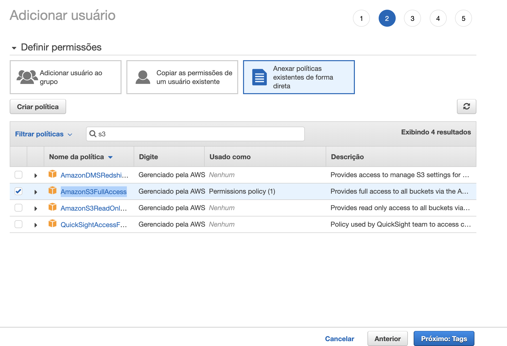

# Instalação

- Instale as dependencias com **npm install** ou **yarn**
- Use o **.env.example** para criar um novo **.env**
- O DB pode usar um container docker:

```
docker run --name mongouploads3 -p 27017:27017 -d -t mongo
```

e alterar a linha **DB_URL** para:

```
mongodb://localhost:27017/mongouploads3
```

- As keys da Amazon devem ser gerados no console da AWS -> IAM

```
https://console.aws.amazon.com/iam/home
```

-> Usuarios
-> Botão Adicionar Usuário
-> Preencher nome e marcar a opção Acesso programático
-> Nas pagina de definição de Permissões clique na caixa Anexar políticas existentes de forma direta, e procure no filtro por AmazonS3FullAccess

-> De next e por fim terá as chaves de acesso para usar.

-> Acesse o s3 e crie um bucket "pasta" e use-a para preencher o env também.

```
https://console.aws.amazon.com/s3
```

## Pós

- Utilize a aplicação Frontend feita em React Js disponível aqui -> <a href="https://github.com/marlonauthority/reactjs-upload-images-with-amazonaws">React Js</a>
